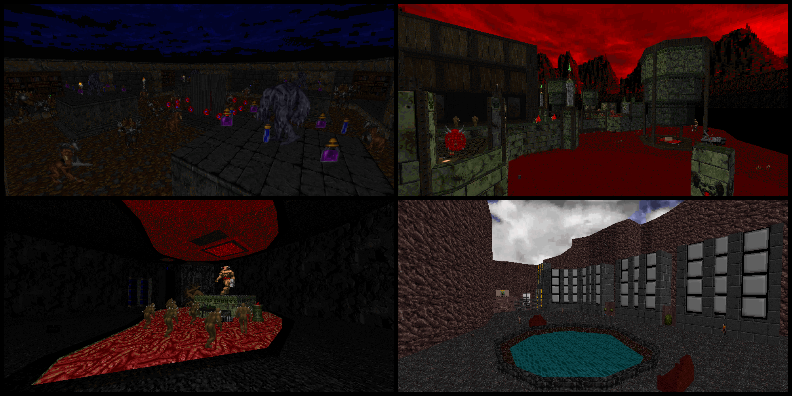

# Russian Random Speedmap Pack 1 [Community Project, 18 maps]

A community project organized by me for russian doom community

# STATUS: ✅RELEASED

### Download - [Latest Release](https://github.com/dron12261games/CPL-RRSP1/releases/download/v1/RRSP1.zip)

# Links (all information inside)
- [Doomworld](https://www.doomworld.com/forum/topic/141189-russian-random-speedmap-pack-1-18-totally-different-maps/?tab=comments#comment-2725910)
- [Doom Power](http://i.iddqd.ru/viewtopic.php?p=135537)

# Project screenshots:

# List of my maps:
- Lair Under Base [3 hours, Limit-Removing, Doom]
- Madness in the depths [10 hours, Boom, Doom 2]
- Light! Camera! BOOM! [6 hours, Boom, Doom 2]

# Screenshots:

## Lair Under Base

## Madness in the depths

## Light! Camera! BOOM!

